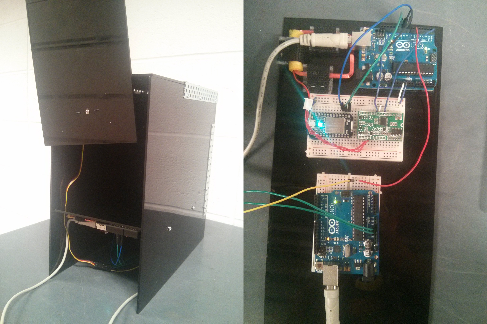

# mousetrap

An RFID-based, weatherproof logging and capture system for use in outdoor experimental setups, 
driven by Spark Core and Arduino microcontrollers. We hope to deploy **mousetraps** at the Stony 
Ford Research Station at Princeton University, on mouse enclosures.

### Currently

**mousetrap** is in a prototype, proof-of-concept stage. We've constructed an RFID-activated 
trap, and can control which "mouse" to catch using the Spark's mobile app. The prototype was 
built from laser-cut acrylic, and is composed of a primary Arduino Uno for RFID and servo 
control, a UART 125kHz RFID module by Asiawill, a Spark Core to control which RFID codes get 
accepted, and a secondary Arduino Uno to power the servo separately, as one Arduino was unable 
to power both the servo and the Spark Core.

### Roadmap

#### Logging

We first want to develop a datalogger for when mice go to feed. We hope to build this entirely 
around the Spark Core, which will act as a server. When mice activate the RFID reader, the Spark 
Core will publish ID and time to the Spark Cloud. The client will be a Raspberry Pi, 
continuously listening for events on the cloud, and processing them from JSON into CSV format.

#### Trapping

Building on the logging module, we will add some servo-driven doors around the feeding stations. 
Instructions on which mice to trap will be sent through the Spark mobile app. Once the mouse 
wanders in to feed, doors are shut and an email is sent to researchers to alert them. Depending 
on servo control, we may need to add a 3.3V to 5V converter, or an Arduino.
